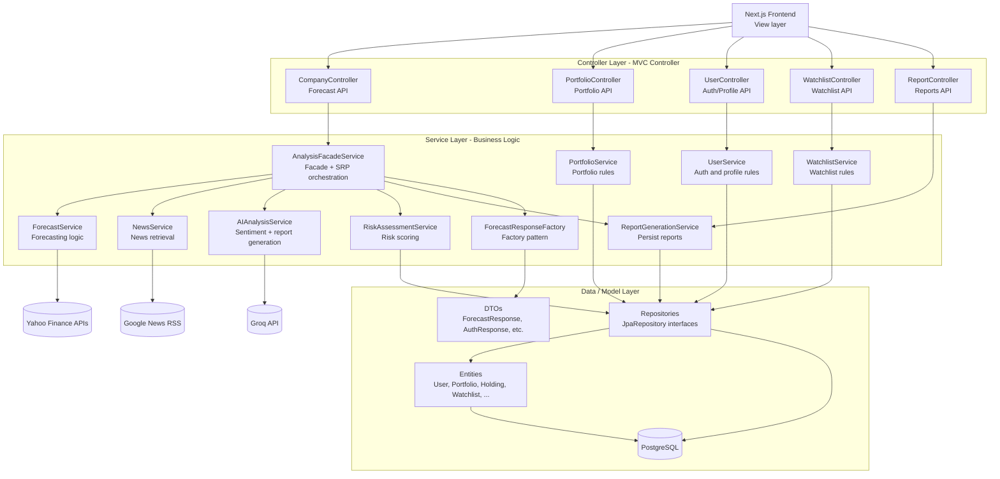

# InsightInvest Java Backend (Spring Boot + Maven)

This backend replaces the original Python API with a Java implementation aligned to your OOAD layered architecture (entity/controller/service/repository).

## Run

1. Create PostgreSQL database `insightinvest`.
2. Copy `.env.example` values into your environment.
3. Start server:

```bash
mvn spring-boot:run
```

Server runs on `http://localhost:8000` by default.

## Main Endpoint

- `GET /forecast/{symbol}`
- Optional query params:
  - `steps` (default `10`)
  - `period` (default `6mo`)
  - `newsItems` (default `15`)

Response keys are compatible with the existing Next.js frontend (`investment_report`, `market_sentiment.analysis`, `visualization.chart`, `news_headlines`, `financial_metrics`).

## Design Notes

This backend is intentionally organized so you can point to specific OOAD concepts in a presentation:

- SOLID: `AnalysisFacadeService` now focuses on orchestration, while `ForecastResponseFactory` handles response creation and `ForecastService` handles forecasting logic.
- GRASP: `ForecastService`, `NewsService`, `RiskAssessmentService`, and `ReportGenerationService` show high cohesion because each class has one focused responsibility.
- GRASP: coupling stays low because controllers talk to services, and services depend on repository and utility abstractions rather than doing everything themselves.
- MVC: controllers act as the web layer, services contain business logic, and entities/DTOs form the model layer for the REST API.
- Creational pattern: `ForecastResponseFactory` centralizes construction of the complex `ForecastResponse` object.

## Presentation Diagram



### What To Say In Presentation

- MVC: `CompanyController` and the other controllers are the controller layer, services are the business layer, and entities/DTOs are the model layer.
- SOLID SRP: `AnalysisFacadeService` orchestrates the analysis flow, while `ForecastResponseFactory` builds the response object.
- GRASP High Cohesion: `ForecastService`, `NewsService`, `RiskAssessmentService`, and `ReportGenerationService` each have one focused responsibility.
- GRASP Low Coupling: controllers talk to services, and services depend on repositories or helpers instead of each class doing everything.
- Creational Pattern: `ForecastResponseFactory` is the factory used to create the final analysis response.
